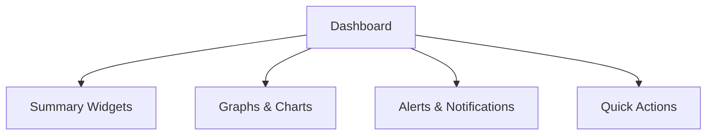

# Dashboard - Admin Console

## Overview

เมนู **Dashboard** เป็นจุดเริ่มต้นและศูนย์กลางในการแสดงข้อมูลภาพรวมที่สำคัญของระบบ Admin Console สำหรับทีมบริหารและผู้ดูแลระบบ เพื่อให้สามารถติดตามสถานะและประสิทธิภาพของธุรกิจได้อย่างรวดเร็วและแม่นยำ

---

## Key Objectives

- สรุปข้อมูลที่สำคัญสำหรับการตัดสินใจ
- แสดงสถิติและแนวโน้มแบบ Real-time หรือ Near Real-time
- รองรับการแสดงผลข้อมูลในรูปแบบกราฟ, Widget, Alert และ Quick Actions
- ออกแบบให้ใช้งานง่าย เข้าใจได้ทันที (Visual-driven, Minimal, Responsive)

---

## Main Components

1. **Summary Widgets**
   - ยอดขายรวม (GMV)
   - กำไรขั้นต้น (GP)
   - รายได้สุทธิ (Net Revenue)
   - จำนวนธุรกรรม
   - จำนวนสมาชิกใหม่/สมาชิกทั้งหมด

2. **Graphs & Charts**
   - กราฟยอดขายรายวัน/เดือน
   - กราฟสมาชิกใหม่
   - Pie Chart สัดส่วนวิธีชำระเงิน
   - กราฟธุรกรรมจำแนกตามสถานะ (Success/Pending/Failed)

3. **Alerts & Notifications**
   - แจ้งเตือนร้านค้า/ลูกค้าที่ใกล้หมดอายุ
   - ธุรกรรมที่รอการตรวจสอบ
   - ปัญหา/รายการที่ต้องการ Action ด่วน

4. **Quick Actions**
   - ปุ่มลัดสำหรับเพิ่มร้านค้า/ลูกค้า/คูปอง/โปรโมชัน
   - ปุ่ม Export ข้อมูลสรุป

---

## Design Guidelines

- **Minimal & Clean UI:** เน้นความเรียบง่าย ใช้สีและ icon ที่สื่อความหมายชัดเจน
- **Responsive:** รองรับทุกหน้าจอ (Desktop, Tablet, Mobile)
- **Real-time/Auto Refresh:** Update ข้อมูลอัตโนมัติหรือมีปุ่ม Refresh
- **Customizable:** อนุญาตให้ผู้ใช้เลือก Widget หรือ Chart ที่ต้องการแสดง
- **Accessibility:** รองรับมาตรฐาน WCAG (ขนาดตัวอักษร, Contrast, Keyboard Navigation)

---

## Best Practices

- **Load เร็ว:** ใช้เทคนิค Lazy Load, Skeleton Screen, Cache ข้อมูล
- **Error Handling:** แสดงข้อความกรณีข้อมูลผิดพลาดหรือโหลดไม่สำเร็จ
- **Data Source:** แยก logic การดึงข้อมูลและการแสดงผล (ใช้ API/Service ที่ปลอดภัย)
- **Security:** Mask/Hide ข้อมูลสำคัญตามสิทธิ์ผู้ใช้
- **Permission Control:** แสดง Widget/ข้อมูลตามสิทธิ์ (Role/Group/Org) ของผู้ใช้งาน

---

## Developer Notes

- ใช้ Component Library ที่รองรับ Responsive & Accessibility เช่น MUI, Ant Design หรือ Bootstrap
- รองรับ Multi-language/Localization
- Log การเข้าถึง Dashboard สำหรับ Audit Trail
- หากมีข้อมูลจำนวนมาก ให้ใช้การ Paginate/Drill-down ไปยังรายงานละเอียด

---

## Future Enhancements

- ให้ผู้ใช้ Drag & Drop ปรับตำแหน่ง Widget ได้เอง
- รองรับการตั้ง Alert เฉพาะเจาะจง/กำหนดเอง
- เพิ่ม Integration กับระบบ BI/Analytics ภายนอก

---

## Example Layout

---

## Contact & Support

- หากพบปัญหาหรือมีข้อเสนอแนะ ติดต่อทีม DevOps หรือ Product Owner ผ่านระบบ Support Center ในเมนูหลัก
