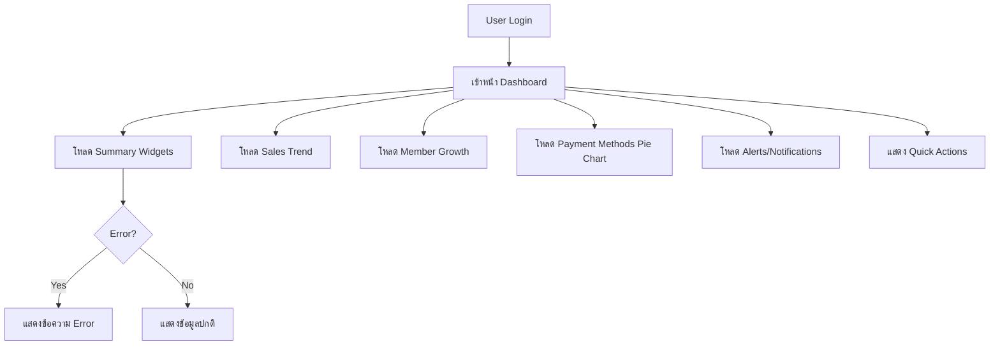

# Dashboard Flow Diagram

```mermaid
flowchart TD
    A[User Login] --> B[เข้าหน้า Dashboard]
    B --> C[โหลด Summary Widgets]
    B --> D[โหลด Sales Trend]
    B --> E[โหลด Member Growth]
    B --> F[โหลด Payment Methods Pie Chart]
    B --> G[โหลด Alerts/Notifications]
    B --> H[แสดง Quick Actions]
    C --> I{Error?}
    I -- Yes --> J[แสดงข้อความ Error]
    I -- No --> K[แสดงข้อมูลปกติ]
```
