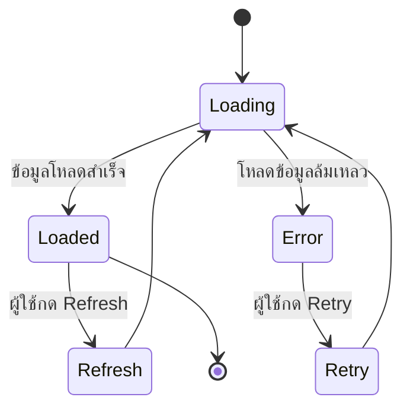

# Dashboard State Diagram

```mermaid
stateDiagram-v2
    [*] --> Loading
    Loading --> Loaded : ข้อมูลโหลดสำเร็จ
    Loading --> Error : โหลดข้อมูลล้มเหลว
    Loaded --> Refresh : ผู้ใช้กด Refresh
    Refresh --> Loading
    Loaded --> [*]
    Error --> Retry : ผู้ใช้กด Retry
    Retry --> Loading
```
