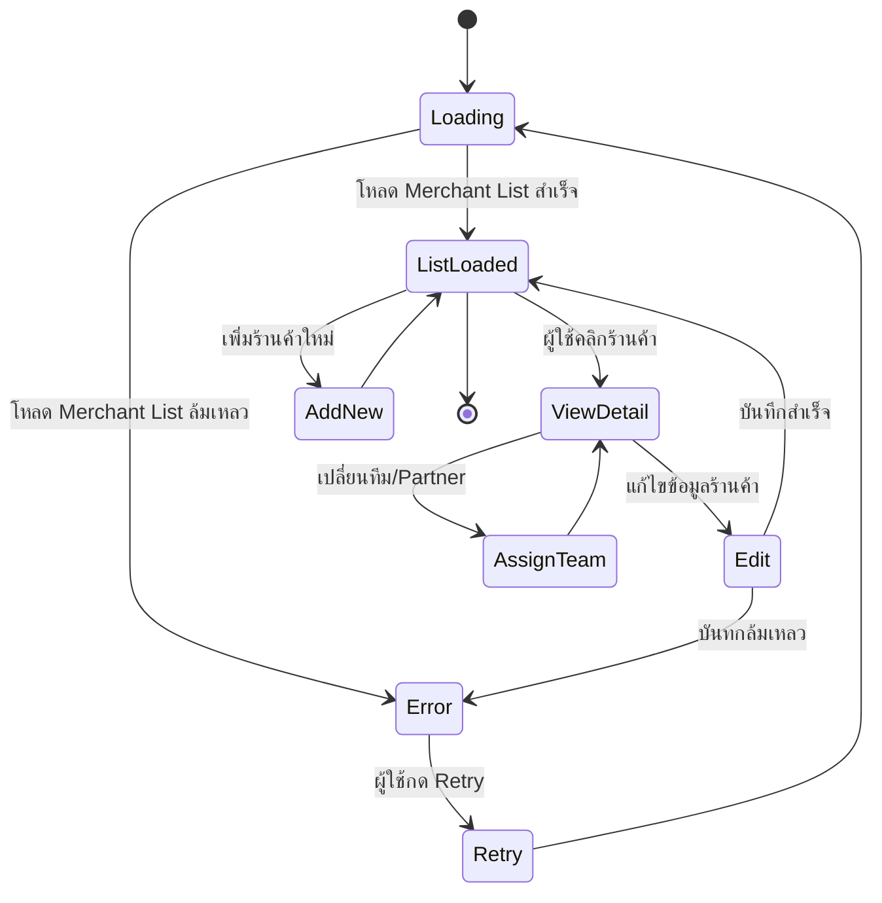

# Merchant & Marketplace Management - State Diagram

```mermaid
stateDiagram-v2
    [*] --> Loading
    Loading --> ListLoaded : โหลด Merchant List สำเร็จ
    Loading --> Error : โหลด Merchant List ล้มเหลว
    ListLoaded --> ViewDetail : ผู้ใช้คลิกร้านค้า
    ViewDetail --> Edit : แก้ไขข้อมูลร้านค้า
    Edit --> ListLoaded : บันทึกสำเร็จ
    Edit --> Error : บันทกล้มเหลว
    ViewDetail --> AssignTeam : เปลี่ยนทีม/Partner
    AssignTeam --> ViewDetail
    ListLoaded --> AddNew : เพิ่มร้านค้าใหม่
    AddNew --> ListLoaded
    ListLoaded --> [*]
    Error --> Retry : ผู้ใช้กด Retry
    Retry --> Loading
```
