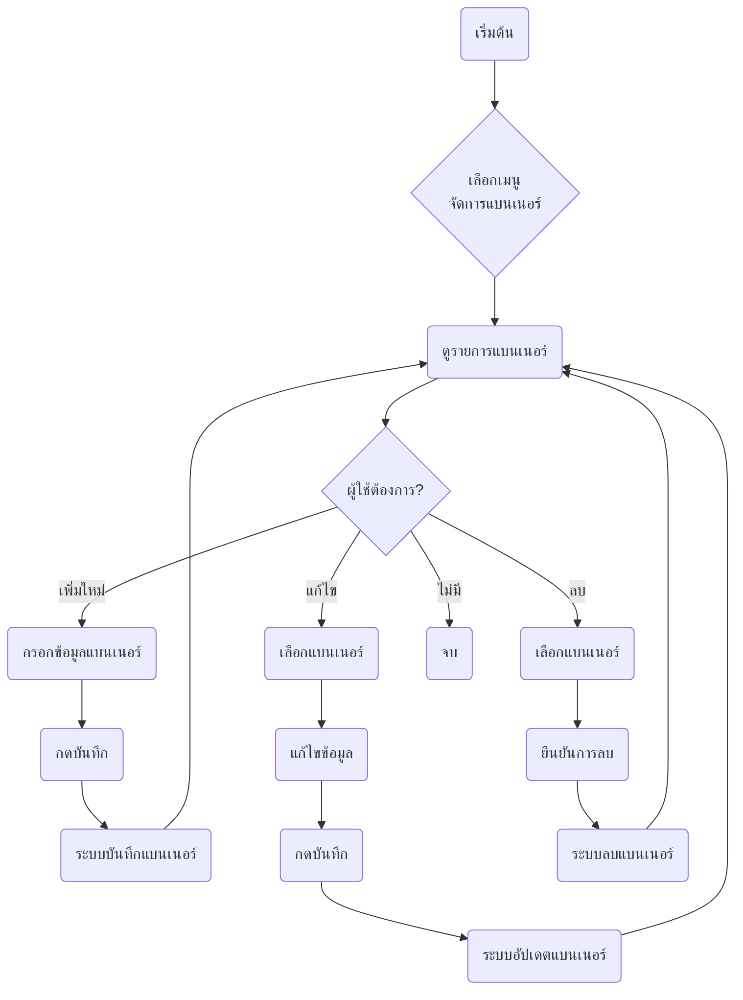

# แผนภาพ Flow การทำงาน (Mermaid)

```mermaid
flowchart TD
  A(เริ่มต้น) --> B{เลือกเมนู<br>จัดการแบนเนอร์}
  B --> C(ดูรายการแบนเนอร์)
  C --> D{ผู้ใช้ต้องการ?}
  D -->|เพิ่มใหม่| E(กรอกข้อมูลแบนเนอร์)
  E --> F(กดบันทึก)
  F --> G(ระบบบันทึกแบนเนอร์)
  G --> C
  D -->|แก้ไข| H(เลือกแบนเนอร์)
  H --> I(แก้ไขข้อมูล)
  I --> J(กดบันทึก)
  J --> K(ระบบอัปเดตแบนเนอร์)
  K --> C
  D -->|ลบ| L(เลือกแบนเนอร์)
  L --> M(ยืนยันการลบ)
  M --> N(ระบบลบแบนเนอร์)
  N --> C
  D -->|ไม่มี| O(จบ)
```
