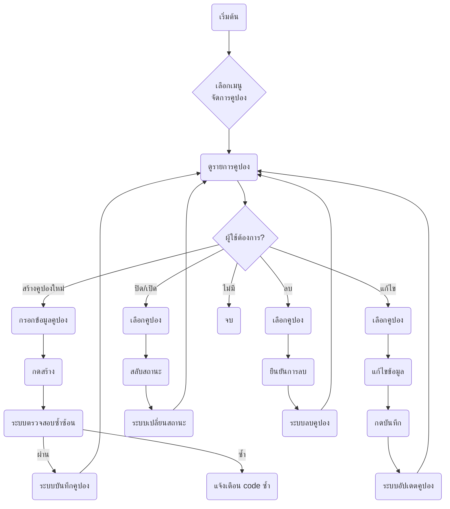

# แผนภาพ Flow การทำงาน (Mermaid)

```mermaid
flowchart TD
  AA(เริ่มต้น) --> BB{เลือกเมนู<br>จัดการคูปอง}
  BB --> CC(ดูรายการคูปอง)
  CC --> DD{ผู้ใช้ต้องการ?}
  DD -->|สร้างคูปองใหม่| EE(กรอกข้อมูลคูปอง)
  EE --> FF(กดสร้าง)
  FF --> GG(ระบบตรวจสอบซ้ำซ้อน)
  GG -->|ผ่าน| HH(ระบบบันทึกคูปอง)
  GG -->|ซ้ำ| II(แจ้งเตือน code ซ้ำ)
  HH --> CC
  DD -->|แก้ไข| JJ(เลือกคูปอง)
  JJ --> KK(แก้ไขข้อมูล)
  KK --> LL(กดบันทึก)
  LL --> MM(ระบบอัปเดตคูปอง)
  MM --> CC
  DD -->|ปิด/เปิด| NN(เลือกคูปอง)
  NN --> OO(สลับสถานะ)
  OO --> PP(ระบบเปลี่ยนสถานะ)
  PP --> CC
  DD -->|ลบ| QQ(เลือกคูปอง)
  QQ --> RR(ยืนยันการลบ)
  RR --> SS(ระบบลบคูปอง)
  SS --> CC
  DD -->|ไม่มี| TT(จบ)
```
