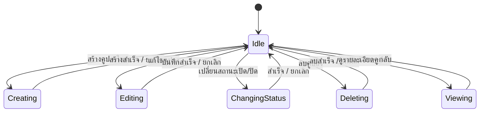

# แผนภาพ State Diagram (Mermaid)

```mermaid
stateDiagram-v2
  [*] --> Idle
  Idle --> Creating: สร้างคูปองใหม่
  Creating --> Idle: สร้างสำเร็จ / ยกเลิก
  Idle --> Editing: แก้ไขคูปอง
  Editing --> Idle: บันทึกสำเร็จ / ยกเลิก
  Idle --> ChangingStatus: เปลี่ยนสถานะเปิด/ปิด
  ChangingStatus --> Idle: สำเร็จ / ยกเลิก
  Idle --> Deleting: ลบคูปอง
  Deleting --> Idle: ลบสำเร็จ / ยกเลิก
  Idle --> Viewing: ดูรายละเอียดคูปอง
  Viewing --> Idle: กลับ
```
