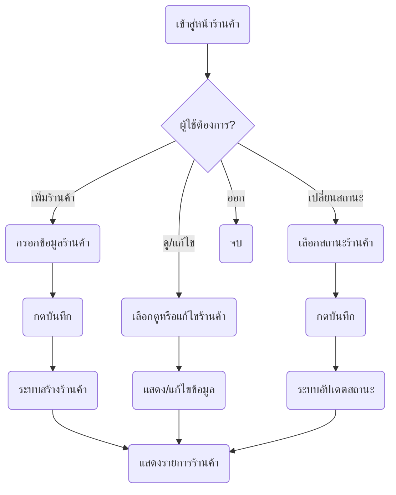

# แผนภาพ Flow การทำงาน (Mermaid) สำหรับ Merchant

```mermaid
flowchart TD
  A(เข้าสู่หน้าร้านค้า) --> B{ผู้ใช้ต้องการ?}
  B -->|เพิ่มร้านค้า| C(กรอกข้อมูลร้านค้า)
  C --> D(กดบันทึก)
  D --> E(ระบบสร้างร้านค้า)
  E --> F(แสดงรายการร้านค้า)
  B -->|ดู/แก้ไข| G(เลือกดูหรือแก้ไขร้านค้า)
  G --> H(แสดง/แก้ไขข้อมูล)
  H --> F
  B -->|เปลี่ยนสถานะ| I(เลือกสถานะร้านค้า)
  I --> J(กดบันทึก)
  J --> K(ระบบอัปเดตสถานะ)
  K --> F
  B -->|ออก| L(จบ)
```
