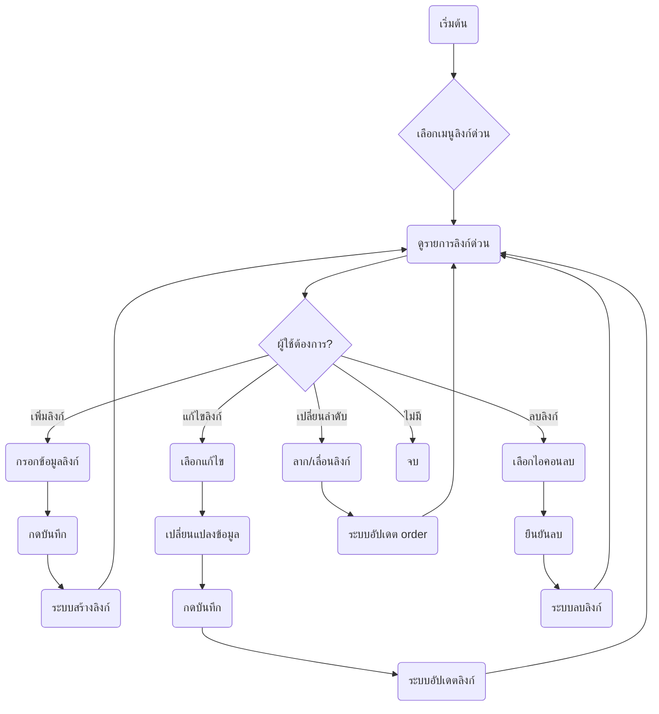

# แผนภาพ Flow การทำงาน Quick Link (Mermaid)

```mermaid
flowchart TD
  A(เริ่มต้น) --> B{เลือกเมนูลิงก์ด่วน}
  B --> C(ดูรายการลิงก์ด่วน)
  C --> D{ผู้ใช้ต้องการ?}
  D -->|เพิ่มลิงก์| E(กรอกข้อมูลลิงก์)
  E --> F(กดบันทึก)
  F --> G(ระบบสร้างลิงก์)
  G --> C
  D -->|แก้ไขลิงก์| H(เลือกแก้ไข)
  H --> I(เปลี่ยนแปลงข้อมูล)
  I --> J(กดบันทึก)
  J --> K(ระบบอัปเดตลิงก์)
  K --> C
  D -->|ลบลิงก์| L(เลือกไอคอนลบ)
  L --> M(ยืนยันลบ)
  M --> N(ระบบลบลิงก์)
  N --> C
  D -->|เปลี่ยนลำดับ| O(ลาก/เลื่อนลิงก์)
  O --> P(ระบบอัปเดต order)
  P --> C
  D -->|ไม่มี| Q(จบ)
```
