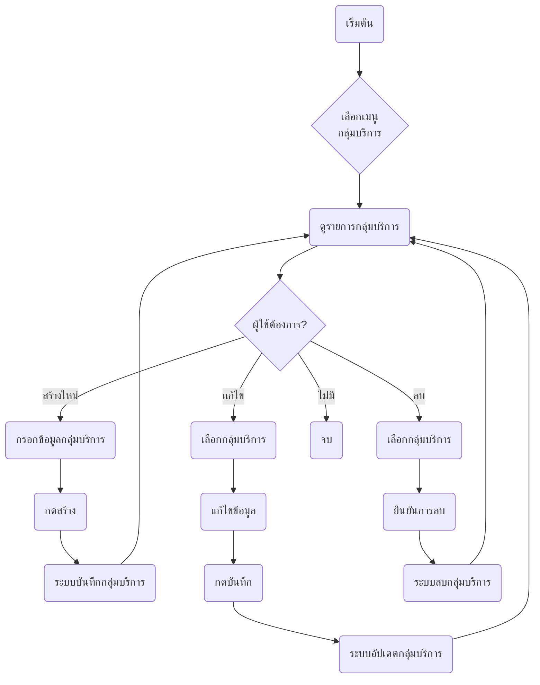

# แผนภาพ Flow การทำงาน (Mermaid)

```mermaid
flowchart TD
  A(เริ่มต้น) --> B{เลือกเมนู<br>กลุ่มบริการ}
  B --> C(ดูรายการกลุ่มบริการ)
  C --> D{ผู้ใช้ต้องการ?}
  D -->|สร้างใหม่| E(กรอกข้อมูลกลุ่มบริการ)
  E --> F(กดสร้าง)
  F --> G(ระบบบันทึกกลุ่มบริการ)
  G --> C
  D -->|แก้ไข| H(เลือกกลุ่มบริการ)
  H --> I(แก้ไขข้อมูล)
  I --> J(กดบันทึก)
  J --> K(ระบบอัปเดตกลุ่มบริการ)
  K --> C
  D -->|ลบ| L(เลือกกลุ่มบริการ)
  L --> M(ยืนยันการลบ)
  M --> N(ระบบลบกลุ่มบริการ)
  N --> C
  D -->|ไม่มี| O(จบ)
```
