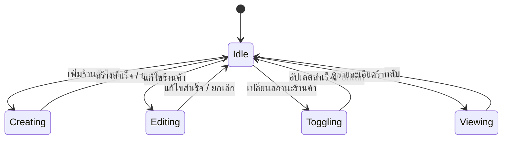

# แผนภาพ State Diagram (Mermaid) สำหรับ Merchant

```mermaid
stateDiagram-v2
  [*] --> Idle
  Idle --> Creating: เพิ่มร้านค้าใหม่
  Creating --> Idle: สร้างสำเร็จ / ยกเลิก
  Idle --> Editing: แก้ไขร้านค้า
  Editing --> Idle: แก้ไขสำเร็จ / ยกเลิก
  Idle --> Toggling: เปลี่ยนสถานะร้านค้า
  Toggling --> Idle: อัปเดตสำเร็จ / ยกเลิก
  Idle --> Viewing: ดูรายละเอียดร้านค้า
  Viewing --> Idle: กลับ
```
