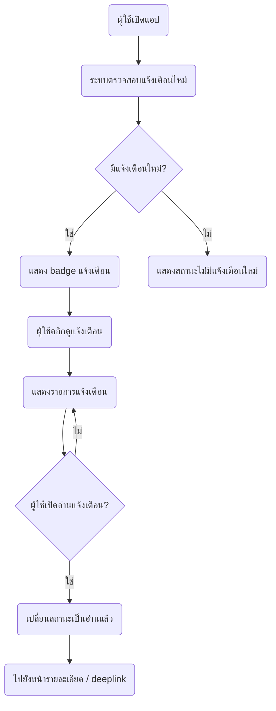

# แผนภาพ Flow การทำงานของ Notification (Mermaid)

```mermaid
flowchart TD
  A(ผู้ใช้เปิดแอป) --> B(ระบบตรวจสอบแจ้งเตือนใหม่)
  B --> C{มีแจ้งเตือนใหม่?}
  C -- ใช่ --> D(แสดง badge แจ้งเตือน)
  D --> E(ผู้ใช้คลิกดูแจ้งเตือน)
  E --> F(แสดงรายการแจ้งเตือน)
  F --> G{ผู้ใช้เปิดอ่านแจ้งเตือน?}
  G -- ใช่ --> H(เปลี่ยนสถานะเป็นอ่านแล้ว)
  H --> I(ไปยังหน้ารายละเอียด / deeplink)
  G -- ไม่ --> F
  C -- ไม่ --> J(แสดงสถานะไม่มีแจ้งเตือนใหม่)
```
