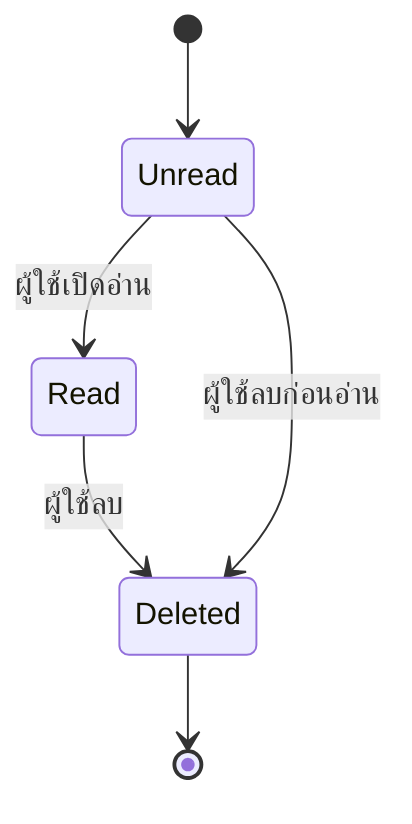

# แผนภาพ State Diagram ระบบแจ้งเตือน (Mermaid)

```mermaid
stateDiagram-v2
  [*] --> Unread
  Unread --> Read: ผู้ใช้เปิดอ่าน
  Read --> Deleted: ผู้ใช้ลบ
  Unread --> Deleted: ผู้ใช้ลบก่อนอ่าน
  Deleted --> [*]
```
