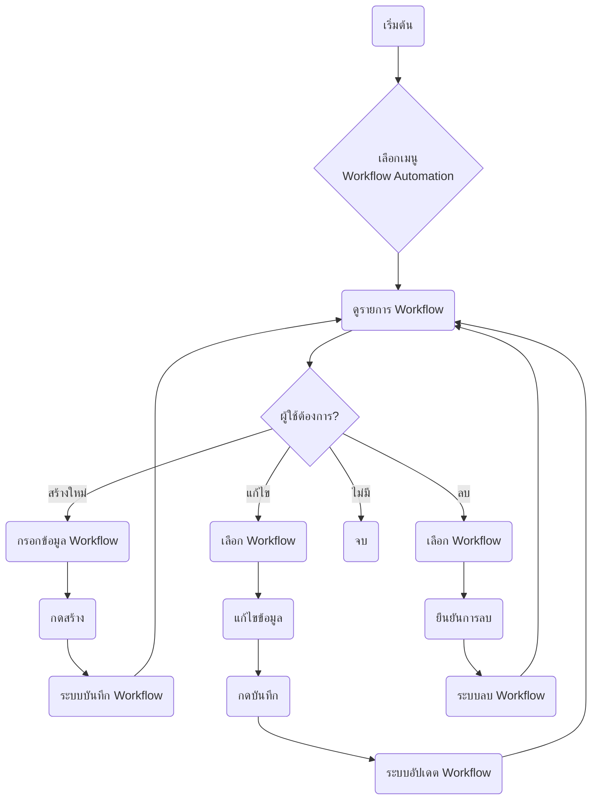

# แผนภาพ Flow การทำงาน (Mermaid)

```mermaid
flowchart TD
  A(เริ่มต้น) --> B{เลือกเมนู<br>Workflow Automation}
  B --> C(ดูรายการ Workflow)
  C --> D{ผู้ใช้ต้องการ?}
  D -->|สร้างใหม่| E(กรอกข้อมูล Workflow)
  E --> F(กดสร้าง)
  F --> G(ระบบบันทึก Workflow)
  G --> C
  D -->|แก้ไข| H(เลือก Workflow)
  H --> I(แก้ไขข้อมูล)
  I --> J(กดบันทึก)
  J --> K(ระบบอัปเดต Workflow)
  K --> C
  D -->|ลบ| L(เลือก Workflow)
  L --> M(ยืนยันการลบ)
  M --> N(ระบบลบ Workflow)
  N --> C
  D -->|ไม่มี| O(จบ)
```
