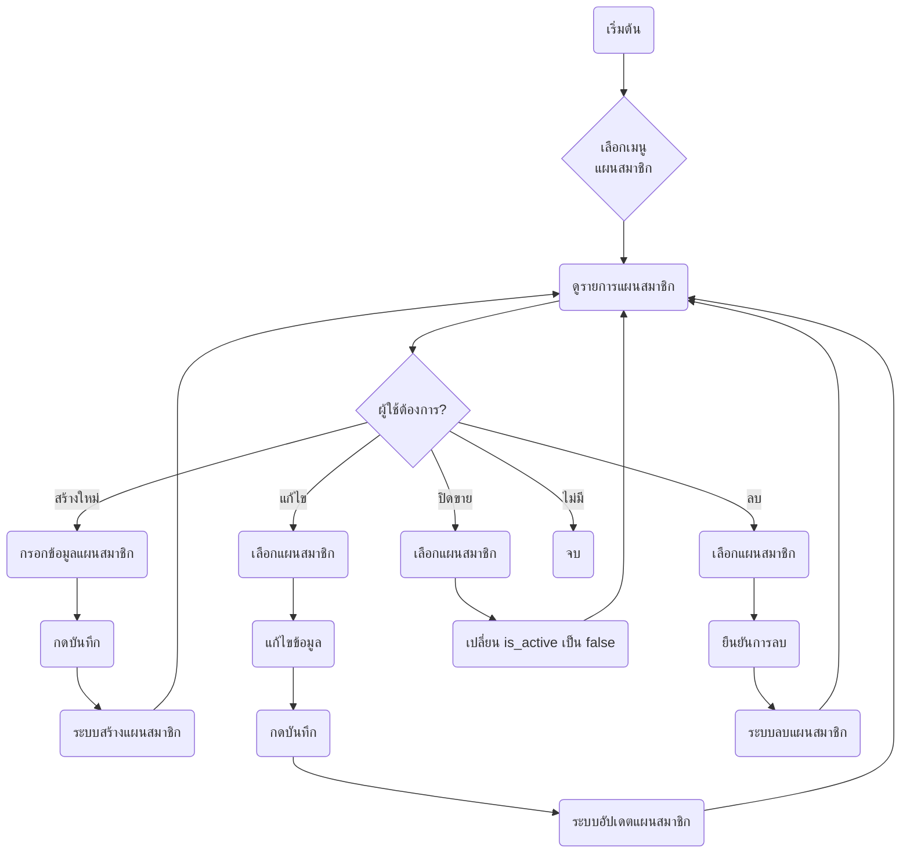

# แผนภาพ Flow การทำงานแผนสมาชิก (Mermaid)

```mermaid
flowchart TD
  A(เริ่มต้น) --> B{เลือกเมนู<br>แผนสมาชิก}
  B --> C(ดูรายการแผนสมาชิก)
  C --> D{ผู้ใช้ต้องการ?}
  D -->|สร้างใหม่| E(กรอกข้อมูลแผนสมาชิก)
  E --> F(กดบันทึก)
  F --> G(ระบบสร้างแผนสมาชิก)
  G --> C
  D -->|แก้ไข| H(เลือกแผนสมาชิก)
  H --> I(แก้ไขข้อมูล)
  I --> J(กดบันทึก)
  J --> K(ระบบอัปเดตแผนสมาชิก)
  K --> C
  D -->|ลบ| L(เลือกแผนสมาชิก)
  L --> M(ยืนยันการลบ)
  M --> N(ระบบลบแผนสมาชิก)
  N --> C
  D -->|ปิดขาย| O(เลือกแผนสมาชิก)
  O --> P(เปลี่ยน is_active เป็น false)
  P --> C
  D -->|ไม่มี| Q(จบ)
```
