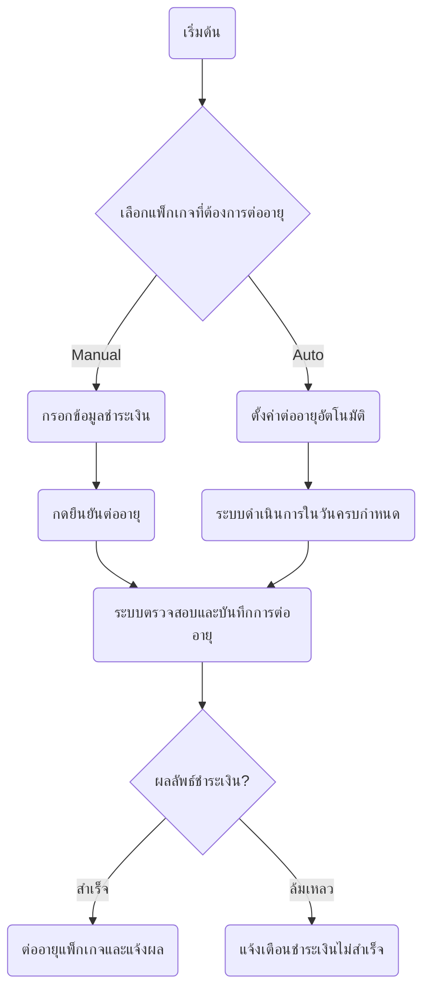

# แผนภาพ Flow การต่ออายุแพ็กเกจ (Mermaid)

```mermaid
flowchart TD
  A(เริ่มต้น) --> B{เลือกแพ็กเกจที่ต้องการต่ออายุ}
  B -->|Manual| C(กรอกข้อมูลชำระเงิน)
  C --> D(กดยืนยันต่ออายุ)
  D --> E(ระบบตรวจสอบและบันทึกการต่ออายุ)
  E --> F{ผลลัพธ์ชำระเงิน?}
  F -->|สำเร็จ| G(ต่ออายุแพ็กเกจและแจ้งผล)
  F -->|ล้มเหลว| H(แจ้งเตือนชำระเงินไม่สำเร็จ)
  B -->|Auto| I(ตั้งค่าต่ออายุอัตโนมัติ)
  I --> J(ระบบดำเนินการในวันครบกำหนด)
  J --> E
```
