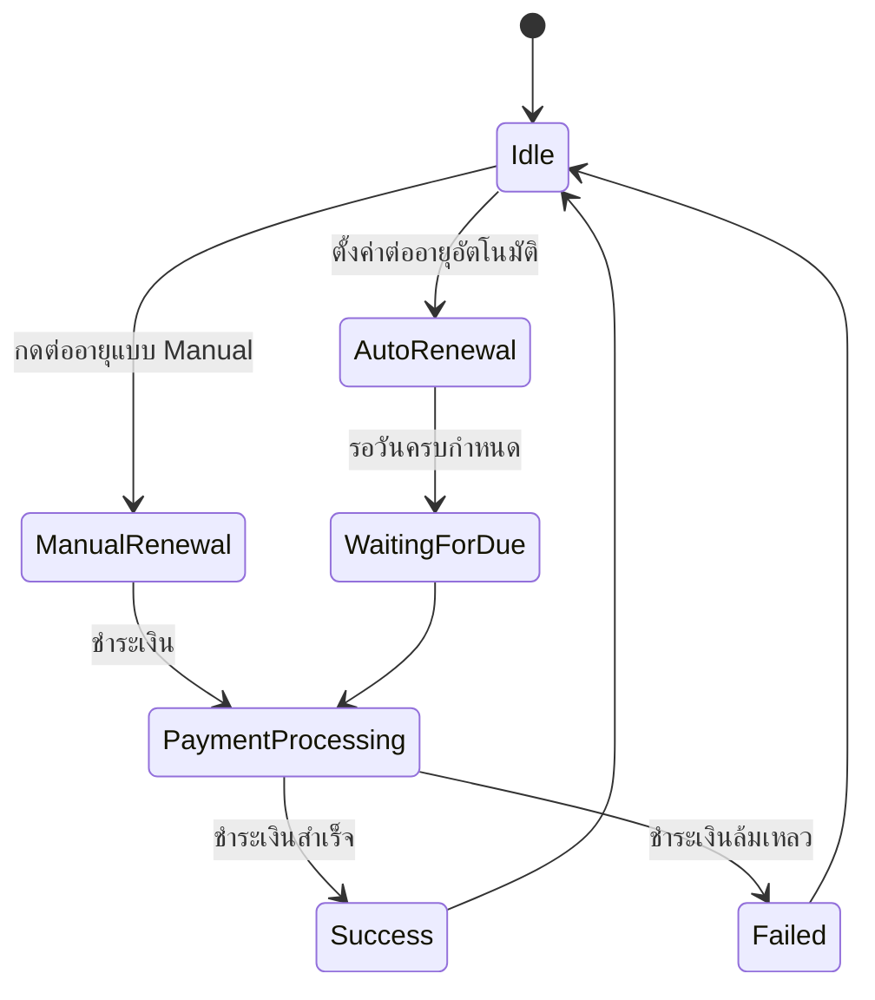

# แผนภาพ State Diagram (Mermaid) สำหรับ Package Renewal

```mermaid
stateDiagram-v2
  [*] --> Idle
  Idle --> ManualRenewal: กดต่ออายุแบบ Manual
  ManualRenewal --> PaymentProcessing: ชำระเงิน
  PaymentProcessing --> Success: ชำระเงินสำเร็จ
  PaymentProcessing --> Failed: ชำระเงินล้มเหลว
  Idle --> AutoRenewal: ตั้งค่าต่ออายุอัตโนมัติ
  AutoRenewal --> WaitingForDue: รอวันครบกำหนด
  WaitingForDue --> PaymentProcessing
  Success --> Idle
  Failed --> Idle
```
