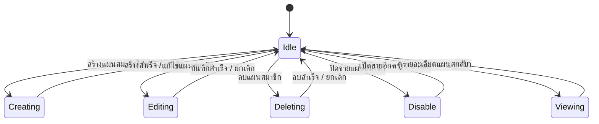

# แผนภาพ State Diagram สำหรับ Plan Subscription (Mermaid)

```mermaid
stateDiagram-v2
  [*] --> Idle
  Idle --> Creating: สร้างแผนสมาชิกใหม่
  Creating --> Idle: สร้างสำเร็จ / ยกเลิก
  Idle --> Editing: แก้ไขแผนสมาชิก
  Editing --> Idle: บันทึกสำเร็จ / ยกเลิก
  Idle --> Deleting: ลบแผนสมาชิก
  Deleting --> Idle: ลบสำเร็จ / ยกเลิก
  Idle --> Disable: ปิดขายแผนสมาชิก
  Disable --> Idle: เปิดขายอีกครั้ง / ยกเลิก
  Idle --> Viewing: ดูรายละเอียดแผนสมาชิก
  Viewing --> Idle: กลับ
```
