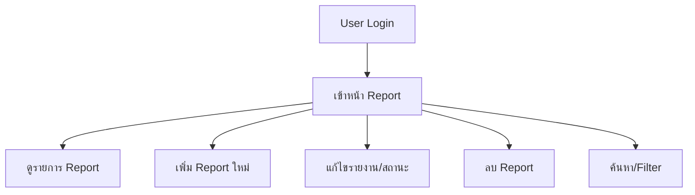

# Report - Flow Diagram

```mermaid
flowchart TD
    A[User Login] --> B[เข้าหน้า Report]
    B --> C[ดูรายการ Report]
    B --> D[เพิ่ม Report ใหม่]
    B --> E[แก้ไขรายงาน/สถานะ]
    B --> F[ลบ Report]
    B --> G[ค้นหา/Filter]
```
