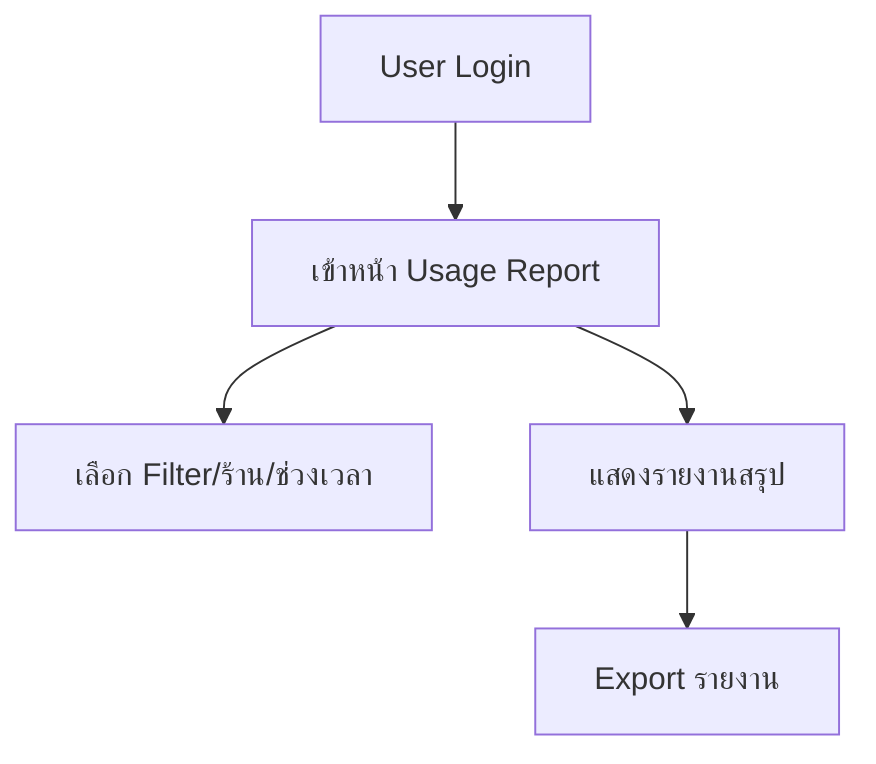

# Usage Report - Flow Diagram

```mermaid
flowchart TD
    A[User Login] --> B[เข้าหน้า Usage Report]
    B --> C[เลือก Filter/ร้าน/ช่วงเวลา]
    B --> D[แสดงรายงานสรุป]
    D --> E[Export รายงาน]
```
