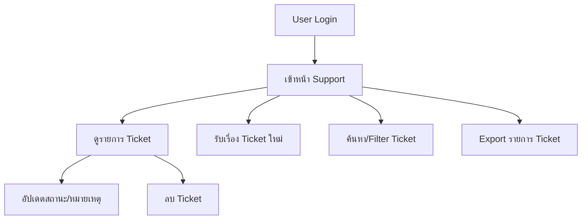

# Support - Flow Diagram

```mermaid
flowchart TD
    A[User Login] --> B[เข้าหน้า Support]
    B --> C[ดูรายการ Ticket]
    B --> D[รับเรื่อง Ticket ใหม่]
    C --> E[อัปเดตสถานะ/หมายเหตุ]
    C --> F[ลบ Ticket]
    B --> G[ค้นหา/Filter Ticket]
    B --> H[Export รายการ Ticket]
```