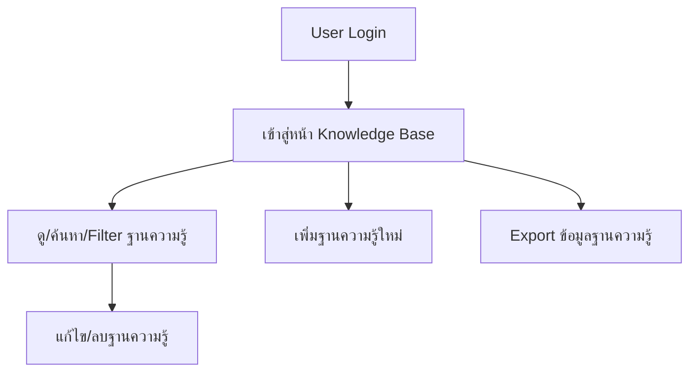

# support/knowledge-base - Flow Diagram

```mermaid
flowchart TD
    A[User Login] --> B[เข้าสู่หน้า Knowledge Base]
    B --> C[ดู/ค้นหา/Filter ฐานความรู้]
    B --> D[เพิ่มฐานความรู้ใหม่]
    C --> E[แก้ไข/ลบฐานความรู้]
    B --> F[Export ข้อมูลฐานความรู้]
```
