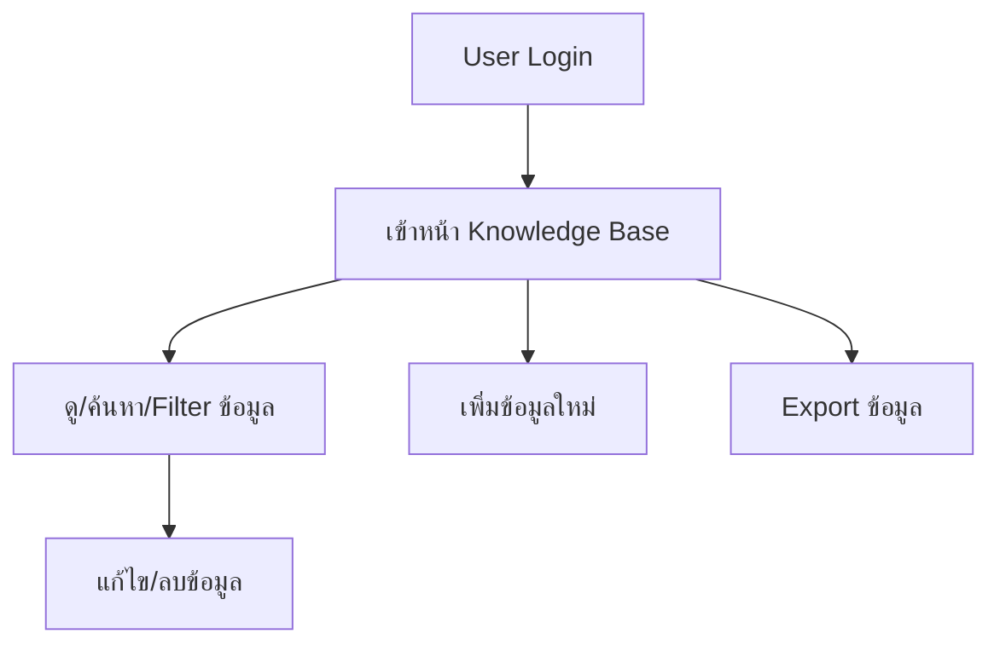

# Knowledge Base - Flow Diagram

```mermaid
flowchart TD
    A[User Login] --> B[เข้าหน้า Knowledge Base]
    B --> C[ดู/ค้นหา/Filter ข้อมูล]
    B --> D[เพิ่มข้อมูลใหม่]
    C --> E[แก้ไข/ลบข้อมูล]
    B --> F[Export ข้อมูล]
```
