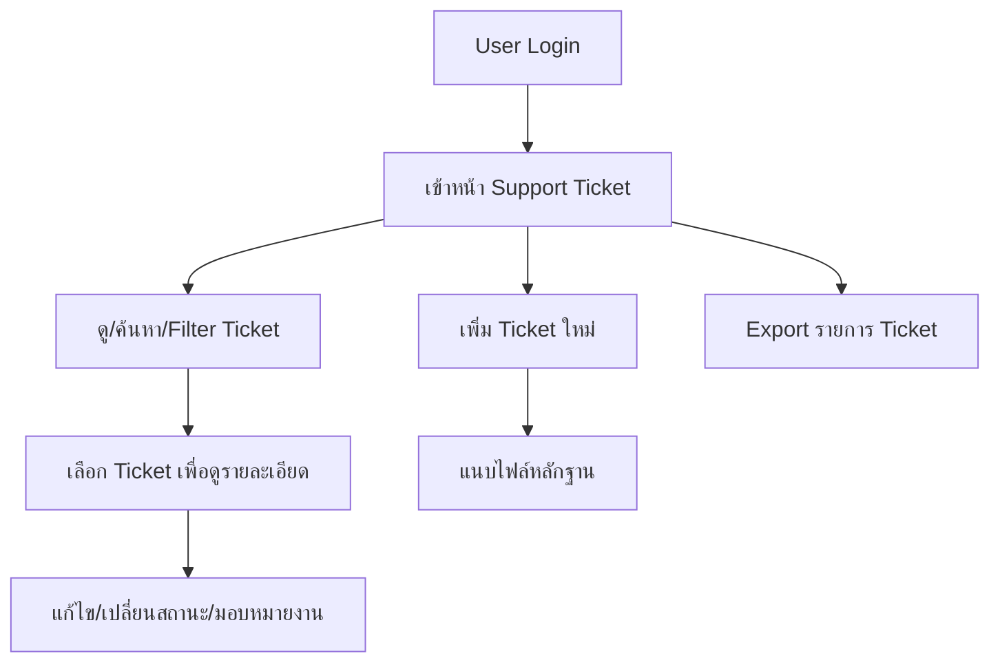

# support/ticket - Flow Diagram

```mermaid
flowchart TD
    A[User Login] --> B[เข้าหน้า Support Ticket]
    B --> C[ดู/ค้นหา/Filter Ticket]
    B --> D[เพิ่ม Ticket ใหม่]
    C --> E[เลือก Ticket เพื่อดูรายละเอียด]
    E --> F[แก้ไข/เปลี่ยนสถานะ/มอบหมายงาน]
    B --> G[Export รายการ Ticket]
    D --> H[แนบไฟล์หลักฐาน]
```
