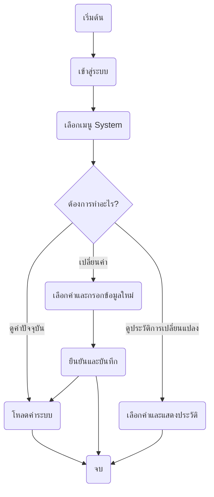

# แผนภาพ Flow การทำงานของ System (Mermaid)

```mermaid
flowchart TD
  A(เริ่มต้น) --> B(เข้าสู่ระบบ)
  B --> C(เลือกเมนู System)
  C --> D{ต้องการทำอะไร?}
  D -->|ดูค่าปัจจุบัน| E(โหลดค่าระบบ)
  D -->|เปลี่ยนค่า| F(เลือกค่าและกรอกข้อมูลใหม่)
  F --> G(ยืนยันและบันทึก)
  G --> E
  D -->|ดูประวัติการเปลี่ยนแปลง| H(เลือกค่าและแสดงประวัติ)
  E --> I(จบ)
  G --> I
  H --> I
```
