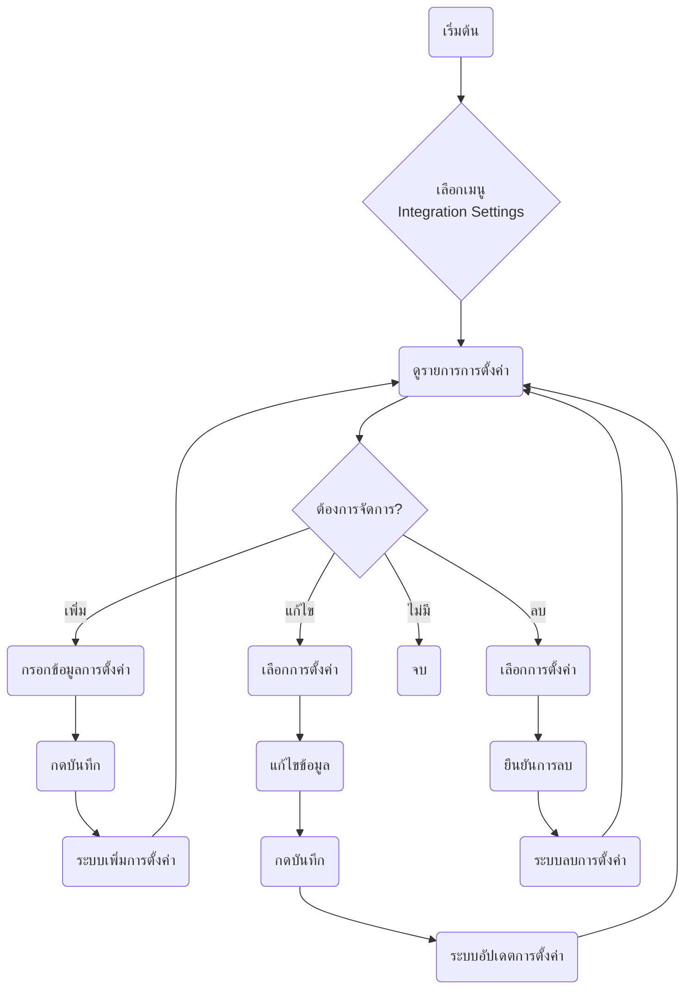

# แผนภาพ Flow การทำงาน (Mermaid)

```mermaid
flowchart TD
  A(เริ่มต้น) --> B{เลือกเมนู<br>Integration Settings}
  B --> C(ดูรายการการตั้งค่า)
  C --> D{ต้องการจัดการ?}
  D -->|เพิ่ม| E(กรอกข้อมูลการตั้งค่า)
  E --> F(กดบันทึก)
  F --> G(ระบบเพิ่มการตั้งค่า)
  G --> C
  D -->|แก้ไข| H(เลือกการตั้งค่า)
  H --> I(แก้ไขข้อมูล)
  I --> J(กดบันทึก)
  J --> K(ระบบอัปเดตการตั้งค่า)
  K --> C
  D -->|ลบ| L(เลือกการตั้งค่า)
  L --> M(ยืนยันการลบ)
  M --> N(ระบบลบการตั้งค่า)
  N --> C
  D -->|ไม่มี| O(จบ)
```
