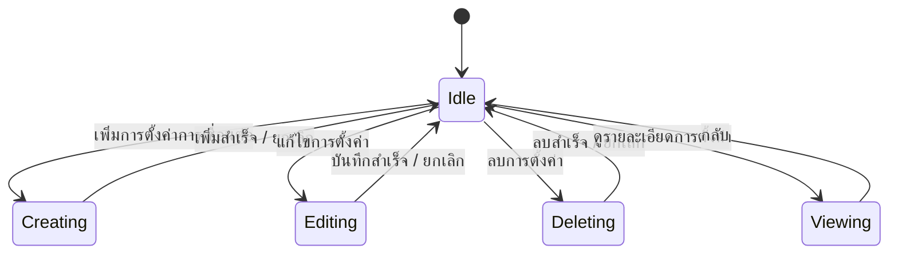

# แผนภาพ State Diagram (Mermaid)

```mermaid
stateDiagram-v2
  [*] --> Idle
  Idle --> Creating: เพิ่มการตั้งค่าการเชื่อมต่อ
  Creating --> Idle: เพิ่มสำเร็จ / ยกเลิก
  Idle --> Editing: แก้ไขการตั้งค่า
  Editing --> Idle: บันทึกสำเร็จ / ยกเลิก
  Idle --> Deleting: ลบการตั้งค่า
  Deleting --> Idle: ลบสำเร็จ / ยกเลิก
  Idle --> Viewing: ดูรายละเอียดการตั้งค่า
  Viewing --> Idle: กลับ
```
