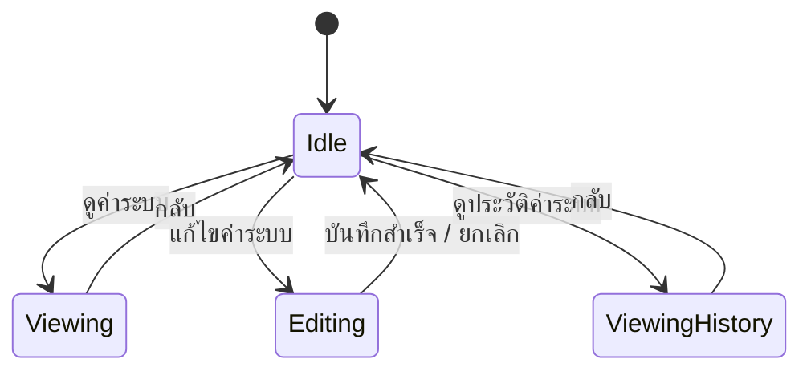

# แผนภาพ State Diagram ของ System (Mermaid)

```mermaid
stateDiagram-v2
  [*] --> Idle
  Idle --> Viewing: ดูค่าระบบ
  Viewing --> Idle: กลับ
  Idle --> Editing: แก้ไขค่าระบบ
  Editing --> Idle: บันทึกสำเร็จ / ยกเลิก
  Idle --> ViewingHistory: ดูประวัติค่าระบบ
  ViewingHistory --> Idle: กลับ
```
