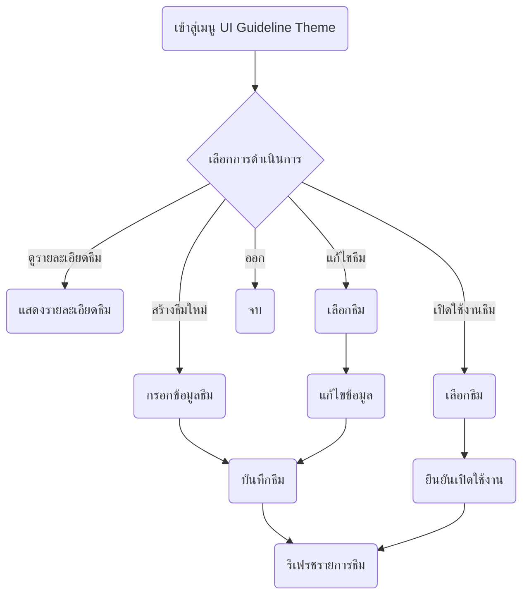

# แผนภาพ Flow การทำงาน (Mermaid)

```mermaid
flowchart TD
  A(เข้าสู่เมนู UI Guideline Theme) --> B{เลือกการดำเนินการ}
  B -->|ดูรายละเอียดธีม| C(แสดงรายละเอียดธีม)
  B -->|สร้างธีมใหม่| D(กรอกข้อมูลธีม)
  D --> E(บันทึกธีม)
  E --> F(รีเฟรชรายการธีม)
  B -->|แก้ไขธีม| G(เลือกธีม)
  G --> H(แก้ไขข้อมูล)
  H --> E
  B -->|เปิดใช้งานธีม| I(เลือกธีม)
  I --> J(ยืนยันเปิดใช้งาน)
  J --> F
  B -->|ออก| K(จบ)
```
