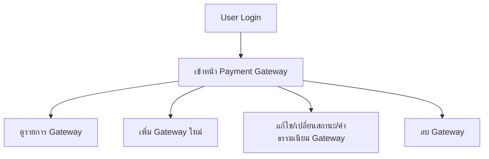

# Payment Gateway - Flow Diagram

```mermaid
flowchart TD
    A[User Login] --> B[เข้าหน้า Payment Gateway]
    B --> C[ดูรายการ Gateway]
    B --> D[เพิ่ม Gateway ใหม่]
    B --> E[แก้ไข/เปลี่ยนสถานะ/ค่าธรรมเนียม Gateway]
    B --> F[ลบ Gateway]
```
