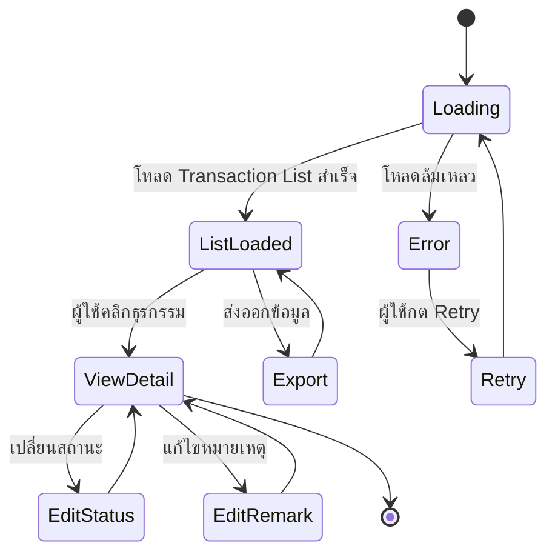

# Transaction & Payment - State Diagram

```mermaid
stateDiagram-v2
    [*] --> Loading
    Loading --> ListLoaded : โหลด Transaction List สำเร็จ
    Loading --> Error : โหลดล้มเหลว
    ListLoaded --> ViewDetail : ผู้ใช้คลิกธุรกรรม
    ViewDetail --> EditStatus : เปลี่ยนสถานะ
    EditStatus --> ViewDetail
    ViewDetail --> EditRemark : แก้ไขหมายเหตุ
    EditRemark --> ViewDetail
    ViewDetail --> [*]
    ListLoaded --> Export : ส่งออกข้อมูล
    Export --> ListLoaded
    Error --> Retry : ผู้ใช้กด Retry
    Retry --> Loading
```
